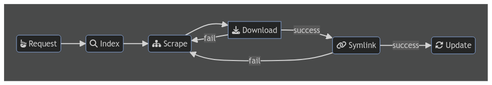

<div align="center">
  <a href="https://github.com/rivenmedia/riven">
    <picture>
      <source media="(prefers-color-scheme: dark)" srcset="https://raw.githubusercontent.com/rivenmedia/riven/main/assets/riven-light.png">
      
    </picture>
  </a>
</div>

<div align="center">
  <a href="https://github.com/rivenmedia/riven/stargazers"></a>
  <a href="https://github.com/dreulavelle/rivenmedia/riven"></a>
  <a href="https://github.com/rivenmedia/riven/blob/main/LICENSE"></a>
  <a href="https://github.com/rivenmedia/riven/graphs/contributors"></a>
  <a href="https://discord.gg/wDgVdH8vNM"></a>
</div>

<div align="center">
  <p>Plex torrent streaming through Real Debrid and 3rd party services like Overseerr, Mdblist, etc.</p>
  <p>Rewrite of <a target="_blank" href="https://github.com/itsToggle/plex_debrid">plex_debrid project.</a></p>
</div>

### Supported Services

Downloaders
-   ✅ Real Debrid
-   ✅ Torbox

Content Services
- ✅ Overseerr
- ✅ Plex Watchlist
- ✅ Mdblist
- ✅ Listrr
- ✅ Trakt

Scrapers
-   ✅ Torrentio
-   ✅ Knightcrawler
-   ✅ Jackett
-   ⏳ Prowlarr (Coming soon)
-   ✅ Orionoid
-   ✅ Annatar
-   ✅ Torbox
-   ✅ Mediafusion
-   ⏳ and more to come!

Check out out [Project Board](https://github.com/users/dreulavelle/projects/2) to stay informed!

Please add feature requests and issues over on our [Issue Tracker](https://github.com/rivenmedia/riven/issues) or join our [Discord](https://discord.gg/wDgVdH8vNM) to chat with us!

We are constantly adding features and improvements as we go along and squashing bugs as they arise.

---

## Table of Contents

- [Table of Contents](#table-of-contents)
- [ElfHosted](#elfhosted)
- [Deployment](#deployment)
  - [Docker Compose](#docker-compose)
    - [What is ORIGIN ?](#what-is-origin-)
  - [Running outside of Docker](#running-outside-of-docker)
    - [First terminal:](#first-terminal)
    - [Second terminal:](#second-terminal)
- [Settings](#settings)
  - [General Settings](#general-settings)
  - [Plex Settings](#plex-settings)
  - [Symlink Settings](#symlink-settings)
  - [Downloaders](#downloaders)
  - [Content Management](#content-management)
  - [Scraping Settings](#scraping-settings)
  - [Ranking Settings](#ranking-settings)
  - [Indexer Settings](#indexer-settings)
- [Development](#development)
  - [Development without `make`](#development-without-make)
- [Contributing](#contributing)
- [License](#license)

## ElfHosted

[ElfHosted](https://elfhosted.com) is a geeky [open-source](https://elfhosted.com/open/) PaaS which provides all the "plumbing" (*hosting, security, updates, etc*) for your self-hosted apps. 

> [!IMPORTANT]
> Riven is a top-tier app in the [ElfHosted app catalogue](https://elfhosted.com/apps/). 30% of your subscription goes to Riven developers, and the remainder offsets [infrastructure costs](https://elfhosted.com/open/pricing/).

> [!TIP] 
> New accounts get $10 free credit, enough for a week's free trial of the [Riven / Plex Infinite Streaming](https://store.elfhosted.com/product/infinite-plex-riven-streaming-bundle) bundle!

(*[ElfHosted Discord](https://discord.elfhosted.com)*)

## Deployment

### Docker Compose

Create a `docker-compose.yml` file with the following contents:

```yml
version: "3.8"

services:
    riven:
        image: rivenmedia/riven:latest
        container_name: riven
        restart: unless-stopped
        environment:
            PUID: "1000"
            PGID: "1000"
            ORIGIN: "http://localhost:3000" # read below for more info
        ports:
            - "3000:3000"
        volumes:
            - ./data:/riven/data
            - /mnt:/mnt
```

Then run `docker compose up -d` to start the container in the background. You can then access the web interface at `http://localhost:3000` or whatever port and origin you set in the `docker-compose.yml` file.

#### What is ORIGIN ?

`ORIGIN` is the URL of the frontend on which you will access it from anywhere. If you are hosting Riven on a vps with IP address `134.32.24.44` then you will need to set the `ORIGIN` to `http://134.32.24.44:3000` (no trailing slash). Similarly, if using a domain name, you will need to set the `ORIGIN` to `http://riven.mydomain.com:3000` (no trailing slash). If you change the port in the `docker-compose.yml` file, you will need to change it in the `ORIGIN` as well.

### Running outside of Docker

To run outside of docker you will need to have node (v18.13+) and python (3.10+) installed. Then clone the repository

```sh
git clone https://github.com/rivenmedia/riven.git
```

and open two terminals in the root of the project and run the following commands in each.

#### First terminal:

```sh
cd frontend
npm install
npm run build
ORIGIN=http://localhost:3000 node build
```

Read above for more info on `ORIGIN`.

#### Second terminal:

```sh
pip install -r requirements.txt
python backend/main.py
```

---

## Settings

Below is a detailed documentation of the available options in the `settings.json` configuration file.

### General Settings
- **version**: Specifies the version of application. (String)
- **debug**: Enables or disables debug mode. (Boolean, Default: True)
- **log**: Enables or disables logging. (Boolean, Default: True)
- **symlink_monitor**: Enables or disables the monitoring of symlinks. Used to propagate plex deletions to the system files. (Boolean, Default: True, inotify needs to be supported in your environment)
- **force_refresh**: Reload your library into plex (Boolean, Default: False)
- **local_only**: Removes the requirement to have plex configured, item gets completed after being symlinked. (Boolean, Default: False)

### Plex Settings
- **plex**:
  - **update_interval**: Frequency in seconds to update Plex library. (Integer, Default: 120)
  - **token**: Authentication token for Plex API. [How to get a plex token](https://support.plex.tv/articles/204059436-finding-an-authentication-token-x-plex-token/) (String)
  - **url**: URL to access Plex server. (String)

### Symlink Settings
- **symlink**:
  - **rclone_path**: Path to the rclone mount. (String)
  - **library_path**: Path to the library directory where the symlinks will be created. (String)

### Downloaders
- **downloaders**:
  - **real_debrid**:
    - **enabled**: Enables or disables the Real Debrid downloader. (Boolean)
    - **api_key**: API key for Real Debrid. You can find it [here](https://real-debrid.com/apitoken) (String)
  - **torbox**:
    - **enabled**: Enables or disables the Torbox downloader. (Boolean)
    - **api_key**: API key for Torbox. You can find it [here](https://torbox.app/settings) (String)

### Content Management
- **content**:
  - **overseerr**:
    - **update_interval**: Frequency in seconds to update Overseerr data. (Integer, Default: 30)
    - **enabled**: Enables or disables Overseerr integration. (Boolean)
    - **url**: URL to access Overseerr. (String)
    - **api_key**: API key for Overseerr. Get it at `http://OVERSEER_HOST/settings` (String)
    - **use_webhook**: Enables or disables the webhook from Overseerr. After enabling this option, you need to go to `http://OVERSEER_HOST/settings/notifications/webhook`, enable the agent and input `http://RIVEN_HOST/webhook/overseerr` into the Webhook URL field.
  - **plex_watchlist**:
    - **update_interval**: Frequency in seconds to check for Plex Watchlist changes. (Integer, Default: 60)
    - **enabled**: Enables or disables Plex Watchlist. (Boolean)
    - **rss**: RSS feed URL for Plex Watchlist. (String, Optional)
  - **mdblist**:
    - **update_interval**: Frequency in seconds to check for list changes. (Integer, Default: 300)
    - **enabled**: Enables or disables Mdblist integration. (Boolean)
    - **api_key**: API key for Overseerr. Get it [here](https://mdblist.com/preferences/) at the bottom. (String)
    - **lists**: IDs of the lists that should be fetched (String Array)
  - **listrr**:
    - **update_interval**: Frequency in seconds to check for list changes. (Integer, Default: 300)
    - **enabled**: Enables or disables Mdblist integration. (Boolean)
    - **movie_lists**: IDs of the movie lists that should be fetched (String Array)
    - **show_lists**: IDs of the show lists that should be fetched (String Array)
    - **api_key**: API key for Listrr. Get it [here](https://listrr.pro/Identity/Account/Manage) (String)
  - **trakt**:
    - **update_interval**: Frequency in seconds to check for list changes. (Integer, Default: 300)
    - **enabled**: Enables or disables Mdblist integration. (Boolean)
    - **api_key**: API key for Trakt. Create a new API App [here](https://trakt.tv/oauth/applications) and copy the client id (String)
    - **watchlist**: Usernames of which the watchlists should be fetched (String Array)
    - **collection**: Usernames of which the collections should be fetched (String Array)
    - **user_lists**: URLs of user lists the should be fetched (String Array)
    - **fetch_treding**: Wheter the trakt trending [movies](https://trakt.tv/movies/trending) and [shows](https://trakt.tv/shows/trending) should be fetched. (Boolean)
    - **trending_count**: How many items from the trending lists should be fetched. Most trending item gets fetched first. (Integer, Default: 10)
    - **fetch_popular**: Wheter the trakt trending [movies](https://trakt.tv/movies/popular) and [shows](https://trakt.tv/shows/popular) should be fetched. (Boolean)
    - **popular_count**: How many items from the popularity lists should be fetched. Most popular item gets fetched first. (Integer, Default: false)

### Scraping Settings
- **scraping**:
  - **after_2**: Delay in hours after which scraping occurs again after 2 retries. (Integer, Default: 2)
  - **after_5**: Delay in hours after which scraping occurs again after 5 retries. (Integer, Default: 6)
  - **after_10**: Delay in hours after which scraping occurs again after 10 retries. (Integer, Default: 24)
  - **torrentio**:
    - **enabled**: Enables or disables torrentio scraping. (Boolean)
    - **filter**: Filter that should be used when querying scraper. (String, Default: `sort=qualitysize%7Cqualityfilter=480p,scr,cam,unknown`)
    - **url**: URL of the torrentio instance. (String, Default: `https://torrentio.strem.fun`)
    - **timeout**: Maximum amount in seconds for the scraping process. (Integer, Default: 30)
    - **ratelimit**: Enables or Disabled the ratelimiting of this scraper. (Boolean, Default: true)
  - **knightcrawler**:
    - **enabled**: Enables or disables knightcrawler scraping. (Boolean)
    - **filter**: Filter that should be used when querying scraper (String, Default: `sort=qualitysize%7Cqualityfilter=480p,scr,cam,unknown`)
    - **url**: URL of the knightcrawler instance. (String, Default: `https://knightcrawler.elfhosted.com`)
    - **timeout**: Maximum amount in seconds for the scraping process. (Integer, Default: 30)
    - **ratelimit**: Enables or Disabled the ratelimiting of this scraper. (Boolean, Default: true)
  - **jackett**:
    - **enabled**: Enables or disables jackett scraping. (Boolean)
    - **url**: URL of the jackett instance. (String, Default: `http://localhost:9117`)
    - **api_key**: API key for jackett. Get it at your jackett dashboard. (String)
    - **timeout**: Maximum amount in seconds for the scraping process. (Integer, Default: 30)
    - **ratelimit**: Enables or Disabled the ratelimiting of this scraper. (Boolean, Default: true)
  - **prowlarr**:
    - **enabled**: Enables or disables prowlarr scraping. (Boolean)
    - **url**: URL of the prowlarr instance. (String, Default: `http://localhost:9696`)
    - **api_key**: API key for prowlarr. Get it at your prowlarr dashboard. (String)
    - **timeout**: Maximum amount in seconds for the scraping process. (Integer, Default: 30)
    - **ratelimit**: Enables or Disabled the ratelimiting of this scraper. (Boolean, Default: true)
  - **orionoid**:
    - **enabled**: Enables or disables orionoid scraping. (Boolean)
    - **api_key**: API key for orioniod. Get it [here](https://panel.orionoid.com/). (String)
    - **limitcount**: Maximum amount of results from this scraper. (Integer, Default: 5)
    - **timeout**: Maximum amount in seconds for the scraping process. (Integer, Default: 30)
    - **ratelimit**: Enables or Disabled the ratelimiting of this scraper. (Boolean, Default: true)
  - **annatar**:
    - **enabled**: Enables or disables annatar scraping. (Boolean)
    - **url**: URL of the annatar instance. (String, Default: `https://annatar.elfhosted.com`)
    - **limit**: Filter that should be used when querying scraper Maximum amount of results from this scraper. (Integer, Default: 2000)
    - **timeout**: Maximum amount in seconds for the scraping process. (Integer, Default: 30)
    - **ratelimit**: Enables or Disabled the ratelimiting of this scraper. (Boolean, Default: true)
  - **torbox_scraper**:
    - **enabled**: Enables or disables torbox scraping. Only works in combination with the torbox downloader. (Boolean)
  - **mediafusion**:
    - **enabled**: Enables or disables mediafusion scraping. (Boolean)
    - **url**: URL of the mediafusion instance. (String, Default: `https://mediafusion.elfhosted.com`)
    - **timeout**: Maximum amount in seconds for the scraping process. (Integer, Default: 30)
    - **ratelimit**: Enables or Disabled the ratelimiting of this scraper. (Boolean, Default: true)
    - **catalogs**: List of catalogs that should be used. You can find all the catalogs [here](https://github.com/mhdzumair/MediaFusion/blob/main/utils/const.py) (String Array)

### Ranking Settings
All ranking settings are explained in the [RTN README](https://github.com/dreulavelle/rank-torrent-name/)

### Indexer Settings
- **indexer**:
  - **update_interval**: Interval in seconds in which the indexer gets resubmitted. (Integer, Default: 3600)

This configuration file allows for extensive customization of the behavior of Riven, including integration with various services and control over downloading and scraping operations. Each section and its options can be tailored to meet specific needs or preferences.

<!-- ### Symlinking settings

<h1 style="color: red">IS THIS SECTION STILL NEEDED? OR SHOULD THIS BE EXPLAINED ABOVE?</h1>

"host_mount" should point to your rclone mount that has your torrents on your host, if you are using native webdav set webdav-url to "https://dav.real-debrid.com/torrents"

"container_mount" should point to the location of the mount in plex container

#### Example:

Rclone is mounted to /riven/vfs on your host machine -> settings should have: "host_mount": "/riven/vfs"

Plex container volume configuration for rclone mount is "/riven/vfs:/media/vfs" -> settings should have: "container_mount": "/media/vfs"

Plex libraries you want to add to sections: movies -> /media/library/movies, shows -> /media/library/shows

--- -->

## Development



You can view the readme in `make` to get started!

```sh
make
```

To get started you can simply do this. This will stop any previous Riven containers and remove previous image.
As well as rebuild the image using cached layers. If your a developer, then any files changed in the code will not get cached,
and thus rebuilt in the image.

```sh
make start
```

You can also restart the container with `make restart`, or view the logs with `make logs`.

### Development without `make`

If you don't want to use `make` and docker, you can use the following commands to run development environment.

```sh
pip install poetry
poetry install
poetry run python backend/main.py
```

```sh
cd frontend
npm install
npm run dev
```

---

## Contributing

Pull requests are welcome. For major changes, please open an issue first to discuss what you would like to change.

We use Black for backend and Prettier for frontend. Please make sure to run the formatters before submitting a pull request. Also use CRLF line endings unless it is a shell script or something that requires LF line endings.

We've switched to Poetry!

Poetry simplifies dependency management by automatically handling package versions and resolving conflicts, ensuring that every contributor works with a consistent set of dependencies. To contribute to this project using Poetry, you'll need to install Poetry on your system. This can be done by `pip install poetry`. Once installed, you can easily manage the project's dependencies.

For starters, after cloning the repository, run `poetry install` in the project's root directory. This command installs all the necessary dependencies as defined in the `pyproject.toml` file, creating an isolated virtual environment for the project. Contributors can then activate the virtual environment using `poetry shell` or run project-related commands directly using `poetry run`. 

Poetry also simplifies the process of adding new dependencies or updating existing ones with commands like `poetry add package-name` and `poetry update package-name`, respectively. Before submitting a pull request, ensure your changes are compatible with the project's dependencies and coding standards. To facilitate this, we encourage contributors to use `poetry run command` to run tests and linters.

---

<a href="https://github.com/rivenmedia/riven/graphs/contributors">
  
</a>

---

## License

This project is licensed under the GNU GPLv3 License - see the [LICENSE](LICENSE) file for details

